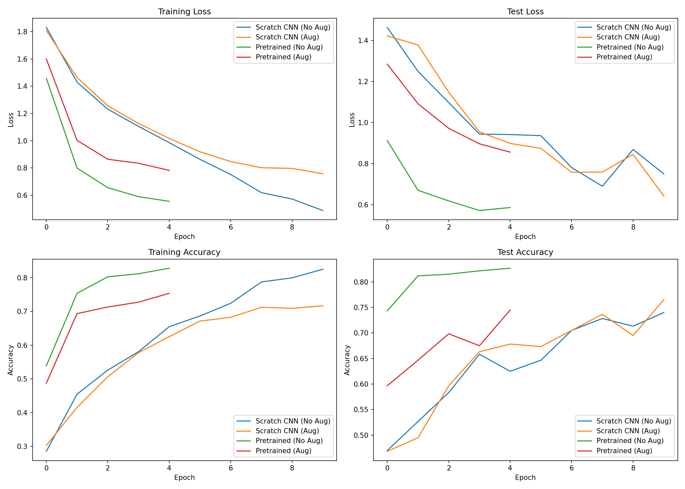
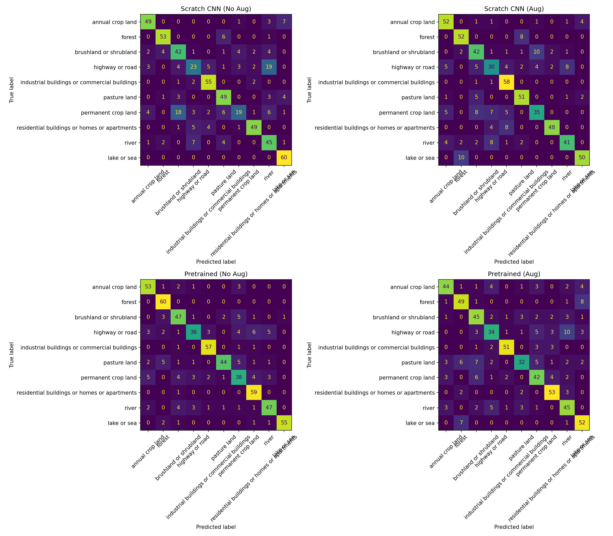

# ACM GenAI Induction — 2026

## 🎤 Task 1: India's Got Latent — Chatbot Act

### The Act
A chatbot with attitude, memory, and zero chill. Pick your persona, walk on stage, and let the roasts/prose/emojis fly.

### Why It'll Impress the Panel
- Multiple personas — RoastBot, ShakespeareBot, Emoji Translator Bot — switchable live from the sidebar
- Real memory — callbacks to anything said earlier in the show
- Live, continuous conversation — no re-running scripts between questions
- Clean chat UI built with Streamlit

### Tech Stack
Python, Groq (Llama 3.3 70B), Streamlit, python-dotenv

### How to Run
1. `git clone <repo-link>` and `cd` into it
2. `python -m venv venv` then activate it
3. `pip install streamlit groq python-dotenv`
4. Create `.env` with `GROQ_API_KEY=your_key_here` (get a free key at console.groq.com)
5. `streamlit run app.py`

### Files
- `app.py` — main Streamlit app (persona + memory + UI)
- `chatbot_basic.py` — terminal chatbot with memory, no persona
- `chatbot_persona.py` — terminal chatbot with persona toggle

---

## 🛰️ Task 2: Project Sentinel — Eyes of the Highway Reserve

### Overview
Image classification pipeline tagging satellite patches (EuroSAT dataset) into 10 land-use categories, comparing 
a from-scratch CNN against a fine-tuned pretrained model, with and without data augmentation.

### Dataset
EuroSAT (RGB), Sentinel-2 imagery, 10 classes. Balanced subset used: 300 images/class training (3,000 total), 
60 images/class testing (600 total).

### Models
1. **TinyVGG (scratch)** — small custom CNN, 2 conv blocks, trained from random initialization
2. **ResNet18 (transfer learning)** — pretrained on ImageNet, final layer replaced and fine-tuned, earlier layers frozen

### Results

| Model | Augmentation | Test Accuracy |
|---|---|---|
| Scratch CNN | No | 72.8% |
| Scratch CNN | Yes | 65.2% |
| Pretrained ResNet18 | No | **84.0%** |
| Pretrained ResNet18 | Yes | 71.3% |

**Loss & Accuracy Curves:**

**Confusion Matrices:**

### Key Findings
- Transfer learning significantly outperformed the scratch CNN, even with fewer epochs (5 vs 10).
- Augmentation reduced accuracy for both models within this short training budget — likely because it increases 
  task difficulty, and the limited epochs weren't enough to realize its generalization benefits.
- Confusion matrices show most misclassifications between visually similar classes (e.g. river vs highway).

### How to Run
Open `satellite/Project_Sentinel_EuroSAT.ipynb` in Google Colab (GPU runtime recommended), run all cells top to bottom.

### Contact
Submitted for ACM BPHC GenAI Team Induction 2026.